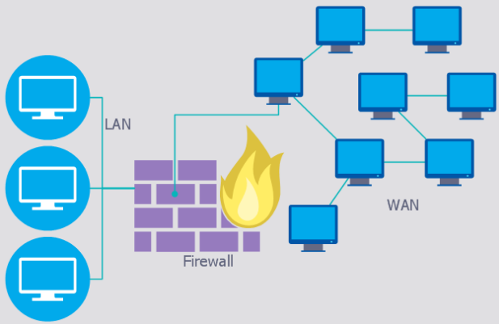
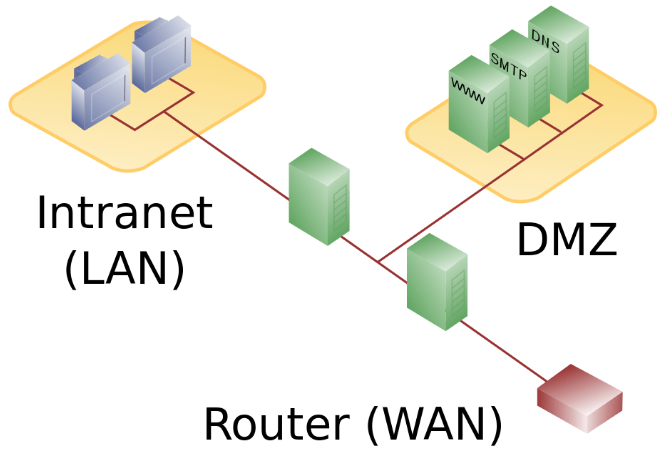
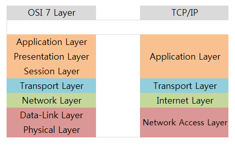
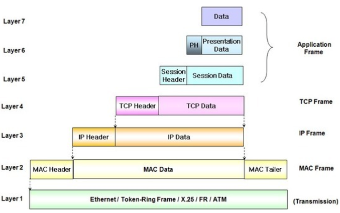

네트워크 이론 - 0장 : 네트워크 이론을 들어가며
===
***

### 기본적인 개념

  - 네트워크(Network) : 컴퓨터간(최소 2대 이상) 연결되어있는 상태를 의미한다.

    
  
  - 패킷(Packet) : 네트워크를 통해 전송되는 **데이터조각**
    
    - 왜 패킷을 이용할까? : 예를 들어 용량이 엄청 큰 데이터가 있다고 가정하자. 한번에 보내면 정말 빠르고 좋지만 용량이 큰 데이터같은 경우 대역폭 점유율이 높아진다.
    결론적으로 패킷을 이용하면 큰 데이터를 여러 작은 패킷들로 나누어 보내면, 대역폭의 점유율의 증가로 인한 다른 패킷의 방해를 최소화할 수 있다.
 
    - 용량이 큰 데이터를 패킷으로 분할하여 보내는 과정(순서대로)
    
        1. 데이터를 여러 작은 패킷으로 분해한다
        2. 나누어진 패킷은 순서대로 도착하지 않는다. 그냥 도착한대로 다시 패킷을 맞추게 되면, 데이터가 변질될 가능성이 있으므로 각 패킷에는 순서에 맞게 번호가 할당된다.
        3. 목적지에 도착한 후 패킷 순서에 맞게 다시 데이터를 조립한다.
    
    - 디지털 데이터 : 디지털 데이터란 0과 1의 집합을 의미한다. 0과 1을 나타내는 최소 단위를 **비트(bit)**라고 한다.
    
        - 1Byte = 8bit
      
        - 1bit에는 0 or 1중 하나가 들어갈 수 있다.

    - LAN 과 WAN
    
        

        - LAN : Local Area Network의 약자이다. 지리적으로 제한된 곳에서 컴퓨터 혹은 프린터등을 연결하는 네트워크이다
      
        - WAN : Wide Area Network의 약자이다. 지리적으로 넓은 범위에 구축된 네트워크 LAN끼리 연결한 것이다. WAN은 ISP(Internet Service Provider)에 의해 제공된다.
      
        - ISP : 인터넷 서비스 제공자로는 흔히아는 통신사(SKT,KT등)가 있다.
    
    - 사내 서버 운영 방식 예시
        
        

        - 회사 네트워크에는 DMZ라는 영역이 존재한다. 
        
        - DMZ란 DeMilitarized Zone의 약자이다. 이는 조직의 내부 네트워트(사내 네트워크)와 외부 네트워크(외부 사용자)사이에 위치한 '서브넷'이다. 내부 네트워크, 외부 네트워크 모두 DMZ에 연결할 수 있도록 허용하면서, DMZ내의 컴퓨터는 오직 외부 네트워크에만 연결할 수 있다. 즉 DMZ내 호스트는 내부 네트워크에 접속이 불가능한 것이다. 이는 내부 네트워크를 보호하기 위함이다.
        
        - 이 DMZ는 외부에 공개를 하기 위한 네트워크이다.(서버를 공개) 공개되는 주된 서버는 다음과 같은것들이 있다.
        
          1. 웹 서버
          2. SMTP(Simple Mail Transfer Protocal) 서버
          3. DNS(Domain Network Service) 서버
        
        - 회사내에서 서버를 운영하는 방식의 대표적인 세가지는 아래와 같다.
        
          1. 서버를 사내에 설치 : 서버 장비실에 렉을 두는 형태
          2. 데이터 센터를 두는 경우
          3. 클라우드(AWS,NCP,GCP ... etc)
          
          여기서 1, 2와 같은 방법들을 통틀어서 **온 프레미스(On-Premise)** 형태라고 부른다
    
    - 프로토콜(Protocal) : 통신을 하기 위해 지정된 특정 규칙 
    
    - OSI 7계층(OSI 7 Layers)
    
        - 컴퓨터간 데이터 송수신을 위해 ISO(International Organization for Standardization)에서 정한 표준 프로토콜
      
        - 각 계층은 독립적이므로 다른 계층에 의한 영향을 받지 않는다.
      
        - OSI 7계층 각 계층은 다음과 같다.(7-최상위 계층 ~ 1-최하위 계층)
      
        |계층번호|계층이름|설명|
        |:------:|:---:|:---:|
        |7|응용 계층|애플리케이션에 대한 서비스를 담당|
        |6|표현 계층|문자코드 압축, 암호화등 데이터 변화를 담당|
        |5|세션 계층|세션 체결, 통신방식 결정 담당|
        |4|전송 계층|신뢰할 수 있는 통신 구현|
        |3|네트워크 계층|타 네트워크 통신을 위한 경로 설정, 논리주소 결정|
        |2|데이터 링크 계층|네트워크 기기간 데이터 전송, 물리주소 결정|
        |1|물리 계층|시스템간 물리적 연결, 전기신호 변환 및 제어 담당|

        - 두개의 컴퓨터가 통신을 할 때 거치는 계층의 순서는 다음과 같다

            - 발신측 7계층 ~ 1계층 -> 전송 -> 수신측 1계층 ~ 7계층
    
    - TCP/IP Protocal

        - TCP/IP는 현재 인터넷에서 컴퓨터들이 서로 정보를 주고 받는데 쓰이는 프로토콜의 모음이다.

        - 하드웨어, 운영체제, 접속매체 관계없이 동작할 수 있는 개방성을 가진다.

        - TCP/IP는 4개의 계층으로 나뉜다.

        |계층번호|계층이름|설명|
        |:------:|:---:|:---:|
        |4|응용 계층|OSI 7계층에서 5,6,7계층의 역할과 동일|
        |3|전송 계층|OSI 7계층에서 4계층의 역할과 동일|
        |2|인터넷 계층|OSI 7계층에서 3계층의 역할과 동일|
        |1|네트워크 접속 계층|OSI 7계층에서 1,2계층의 역할과 동일|

        - TCP/IP vs OSI 7계층

            

            - 두 모델 모두 계층형이라는 공통점이 있다. TCP/IP는 인터넷 개발 이후 계속 표준화 되어 신뢰성이 우수인 반면, OSI 7계층은 표준이 되기는 하지만 실질적으로 구현되는 예가 없어 신뢰성이 많이 저하되어있다.

            - OSI 7계층은 장비 개발 + 통신 자체를 어떻게 표준으로 잡을지에 사용되는 반면, TCP/IP는 실질적인 통신 자체에 사용이된다.
    
    - 캡슐화(Encapsulation)와 역캡슐화

        - 데이터를 전송할 때 각 계층에서 필요한 데이터를 붙여 다음 계층으로 보내지는데, 이 데이터를 '헤더(header)'라고 한다. 캡슐화는 7계층에서 1계층으로 계층을 내려가면서 이루어진다

        - 캡슐화의 예시는 아래 사진과 같다

            

        - 역캡슐화는 역으로 캡슐을 분해해 그 안에있는 데이터를 꺼내는 과정이다. 단순히 생각해 캡슐화의 반대라고 생각하면 된다. 역캡슐화는 1게층에서 7계층으로 계층을 올라가면서 이루어진다.
