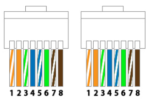

네트워크 이론 - 1장 : 물리계층에 대해
===
***

- 물리계층 : 시스템간 **물리적 연결** 과 **전기신호 변환 및 제어**를 담당한다.

- 우리가 흔히 말하는 데이터(Data)는 결론적으로 0, 1로만 이루어진 '비트열'이다. 이 비트열을 전기신호로 바꾸기 위해서 물리계층이 필요로 한다.

    - 전기신호에는 두가지 종류가 있다.

        |이름|모양설명|그림|
        |:------:|:---:|:---:|
        |아날로그 신호|물결모양, 전화회선, 라디오 방송에 쓰임||
        |디지털 신호| 막대모양 ||

- 0과 1의 비트열인 데이터를 어떻게 전기신호로 변환할까? 이는 PC 메인보드에 장착된 **'랜카드'**가 내장되어 이를 통해 데이터를 송수신한다.

- 여기서 다시한번 물리계층의 정의를 해보면 다음과 같다.

    ~~~
        물리계층 : 컴퓨터, 네트워크 장비들을 연결하고 이들간 전송되는 데이터를 전기신호로 변환하는 계층
    ~~~

- 유선데이터 선로

    - 유선 선로 종류 : 트위스트 페어 케이블, 광케이블 등

    - 무선 선로 종류 : 라디오파, 마이크로파, 적외선파 등

    - 우리는 여기서 유선선로의, 트위스트 페어 케이블(Twist Pair Cable, 흔히 우리가 랜선이라고 부르는것들)에 대해 알아볼 것이다.

- 트위스트 페어 케이블

    - 트위스트 페어 케이블은 우리가 흔히 말하는 '랜 케이블'이다.

    - 트위스트 페어 케이블에는 두 종류가 있다.

        
    
        1. UTP(Unshielded Twisted Pair) Cable

            - 구리선 여덟개를 2개씩 꼬아만든 4쌍의 전선이다. 실드(Shield)로 보호되어 있지 않은 케이블이다.

            - 실드로 보호되지 않기 때문에, 노이즈에 의한 영향을 많이 받는다.

            - 저렴해서 많이 쓴다
        
        2. STP(Shielded Twisted Pair) Cable

            - 2개씩 꼬아만든 구리선 4쌍을 실드(Shield)로 보호한 케이블이다.

            - 실드로 보호되어 노이즈 영향이 매우 적다.

            - 비용이 비싸다.
    
    - 대중적으로 가격이 저렴한 UTP케이블을 많이 사용한다.

    - UTP케이블은 전송 품질에 따라 다음과 같이 분류된다.

        |이름|규격|전송품질(=전송속도)|
        |:------:|:---:|:---:|
        |Cat3|10Base-T|10Mbps|
        |Cat5|100Base-Tx|100Mbps|
        |Cat5e|1000Base-Tx|1000Mbps|
        |Cat6|1000Base-Tx|1000Mbps|
        |Cat6a|10GBase-T|10GMbps|
        |Cat7|10GBase-T|10GMbps|
    
    - Cat5e/Cat6 , Cat6a/Cat7 서로 동일한 성능의 비슷한 케이블이라고 생각하면 된다.

    - 랜케이블 만들기

        - 기본적인 랜케이블 만드는 순서는 다음과 같다.
        
        

        - 각 케이블의 번호는 왼쪽부터 1 ~ 8 이다

    - UTP케이블을 이용해 만든 랜 케이블의 특징, 종류

        - 공통적으로 아래 두가지 케이블 모두 8개의 선을 다 쓰지 않는다. 1,2,3,6번의 구리선만 사용된다

        - 두가지의 종류

            

            - 다이렉트 케이블 : 주로 PC와 스위치 같은 서로 일방적인 데이터 전송을 하는 관계에서 쓰는 랜케이블이다.(PC는 스위치로, 스위치는 PC로 일방적으로 데이터를 보내기만 하면 된다.) 다이렉트 케이블은 각 랜선이 1:1로 연결이 된다. 다이렉트 케이블에서는 양쪽 모두 1,2번 TX(송신 : 출력단자)이고 3,6번 RX(수신 : 입력단자)이다.

                
            
            - 크로스 케이블 : 주로 PC에서 PC와 같이 서로 동시에 데이터 송수신이 가능하게 하기 위해 사용하는 케이블이다. 크로스 케이블은 다이렉트 케이블과 달리
            선이 교차되어있다. 컴퓨터가 다른 케이블로 데이터를 보낼때는 1,2번 선을 이용한다. 만약 컴퓨터간 랜 케이블을 연결할때 다이렉트 케이블로 연결하게 되면 데이터 충돌이 일어난다. 이러한 현상을 방지하기 위해서 선을 교차해서 사용하는 것이다. 한쪽의 1,2가 송신할때 반대쪽의 3,6은 수신을 한다. 랜선은 서로 같은 색의 케이블로 데이터를 전송하기 때문에 크로스 케이블 랜선을 만들때는 아래와 같이 만들어야 한다.

                
